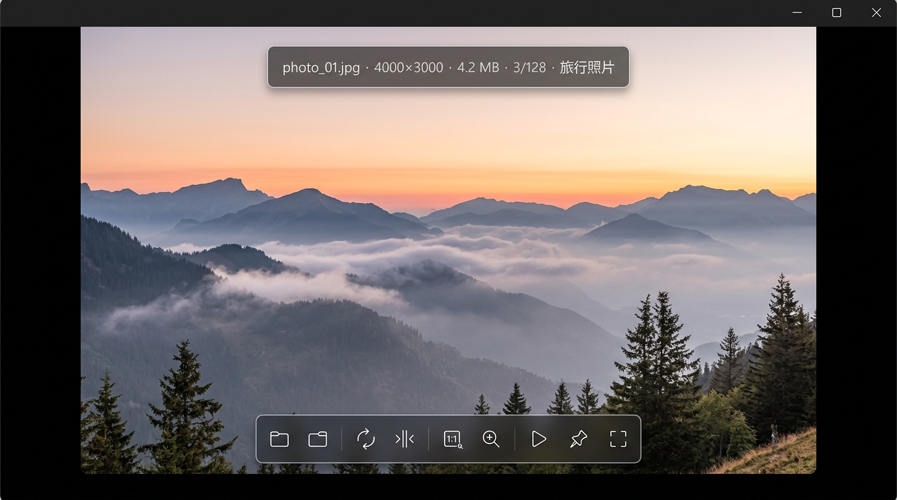
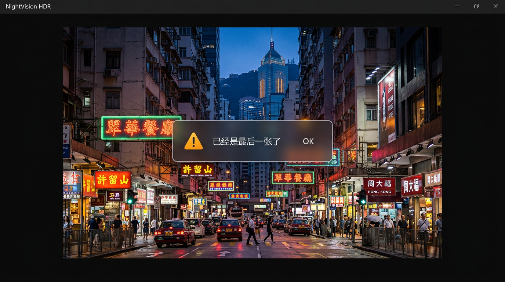
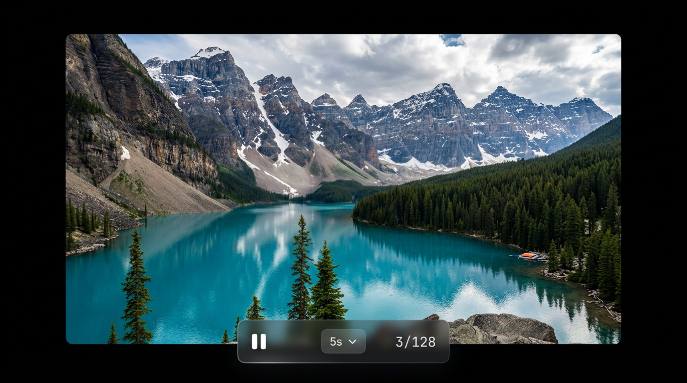

# Image Viewer UI 设计草图

> 配合《需求报告与技术方案.md》使用，本文档定义界面布局、视觉规范与组件状态，供实现智能体直接照图施工。

## 0. 效果图速览

**主界面（普通模式）**



**边界提醒 Toast（沉浸模式中）**



**幻灯片播放模式**



> 说明：效果图为 AI 生成的视觉参考，用于传达风格氛围（毛玻璃质感、深浅层次、浮层关系）；精确布局、尺寸、配色以下文第 2、3 节的规范与线框图为准。

---

## 1. 设计语言

| 关键词 | 说明 |
|--------|------|
| 深色沉浸 | 纯黑画布，图片是唯一主角，UI 只是配角 |
| 毛玻璃浮层 | 所有 UI 控件均为半透明磨砂浮条，悬浮于图片之上，不占固定布局空间 |
| 圆角柔和 | 浮层统一 12px 圆角，按钮 8px 圆角 |
| 微动效 | 所有出现/消失过渡 150~200ms，ease-out 曲线，不弹不晃 |
| 用完即走 | 鼠标闲置 2s 后所有浮层自动隐藏，移动鼠标唤醒 |

## 2. 设计规范（Design Tokens）

### 2.1 配色

| Token | 值 | 用途 |
|-------|-----|------|
| `bg-canvas` | `#000000` | 看图区背景（沉浸模式下） |
| `bg-window` | `#0A0A0A` | 普通模式窗口底色 |
| `glass-bg` | `rgba(28, 28, 30, 0.55)` | 毛玻璃浮层底色 |
| `glass-blur` | `blur(20px) saturate(1.4)` | 毛玻璃模糊参数 |
| `glass-border` | `rgba(255, 255, 255, 0.08)` | 浮层 1px 描边 |
| `text-primary` | `rgba(255, 255, 255, 0.92)` | 主文字 |
| `text-secondary` | `rgba(255, 255, 255, 0.55)` | 次要文字（分隔符、单位） |
| `accent` | `#0A84FF` | 强调色（播放中状态、悬停高亮） |
| `warn` | `#FF9F0A` | 边界提醒 Toast 图标色 |

### 2.2 字体与尺寸

- 字体族：系统默认 UI 字体（Windows 即 Segoe UI Variable / 微软雅黑回退），等宽数字用于计数器（`font-variant-numeric: tabular-nums`）
- 信息条文字 12px，工具栏图标 18px，Toast 文字 14px
- 浮层内边距：`8px 14px`；工具栏按钮热区：`36×36px`，按钮间距 `4px`
- 浮层与窗口边缘间距：`16px`

### 2.3 动效

| 场景 | 时长 | 曲线 |
|------|------|------|
| 浮层淡入/淡出 | 180ms | ease-out / ease-in |
| 图片切换淡入 | 150ms | ease-out |
| Toast 弹出/消失 | 200ms | ease-out，消失带 8px 上移 |
| 缩放/平移 | 跟随手势无延迟 | 无过渡（实时） |
| 旋转/翻转 | 200ms | ease-in-out |

---

## 3. 界面草图

### 3.1 主界面（普通模式）

视觉参考：

```
┌────────────────────────────────────────────────────────────────────┐
│ ●  Image Viewer ─── photo_01.jpg              ─  □  ✕              │ ← 自绘标题栏（毛玻璃，高约32px）
├────────────────────────────────────────────────────────────────────┤
│                                                                    │
│   ┌─── 顶部信息条（毛玻璃浮条，闲置自动隐藏） ──────────────────┐   │
│   │  photo_01.jpg  ·  4000×3000  ·  4.2 MB  ·  3/128  ·  旅行照片 │   │
│   └──────────────────────────────────────────────────────────┘   │
│                                                                    │
│                                                                    │
│                 ┌──────────────────────────┐                       │
│                 │                          │                       │
│                 │                          │                       │
│                 │         图   片           │                       │
│                 │    （居中，适应窗口缩放）   │                       │
│                 │                          │                       │
│                 │                          │                       │
│                 └──────────────────────────┘                       │
│                                                                    │
│                                                                    │
│          ┌─── 底部工具栏（毛玻璃浮条，闲置自动隐藏） ───┐            │
│          │  ◀▶文件夹 │ ↻ ↺ │ ⇋ ⇅ │ 1:1 ▣ │ ▶ │ 📌 ⛶ │            │
│          └───────────────────────────────────────────┘            │
└────────────────────────────────────────────────────────────────────┘
```

**布局要点**
- 图片始终居中，默认适应窗口；窗口四边留白 ≥ 0（图片可贴边）
- 信息条浮于顶部水平居中，距顶 `16px`；工具栏浮于底部水平居中，距底 `16px`
- 工具栏/信息条不挤压图片区域，始终悬浮叠加

### 3.2 底部工具栏细节

```
┌──────────────────────────────────────────────────────────────────┐
│  ⏮ ⏪ 文件夹 ⏩ ⏭   │   ↻  ↺   │   ⇋  ⇅   │  1:1  ▣   │   ▶   │  📌 ⛶  │
└──────────────────────────────────────────────────────────────────┘
   └── 文件夹跳转 ──┘   └─旋转─┘   └─翻转─┘   └─缩放模式─┘  幻灯片  置顶 沉浸
```

| 分组 | 按钮 | 对应快捷键 | 说明 |
|------|------|-----------|------|
| 文件夹 | 首个 / 上一个 / 下一个 / 末个 | PgUp / PgDn | 一键切换同级文件夹 |
| 旋转 | 右旋 90° / 左旋 90° | R / Shift+R | |
| 翻转 | 水平 / 垂直 | H / V | |
| 缩放 | 实际大小 / 适应窗口 | 1 / 0 | 当前模式按钮显示 accent 色 |
| 播放 | 幻灯片播放/暂停 | 空格 | 播放中图标变 ⏸ 并显示 accent 色 |
| 窗口 | 置顶 / 沉浸模式 | T / F | 激活态显示 accent 色 |

- 分组之间用 1px 竖线分隔（`rgba(255,255,255,0.12)`）
- 按钮悬停：底色变 `rgba(255,255,255,0.1)`，显示 tooltip（含快捷键，如「下一张 →」）

### 3.3 顶部信息条细节

```
┌────────────────────────────────────────────────────────────┐
│  photo_01.jpg · 4000×3000 · 4.2 MB · 3/128 · 📁 旅行照片    │
└────────────────────────────────────────────────────────────┘
   └─ 文件名 ─┘  └── 尺寸 ──┘  └ 大小 ┘  └ 位置 ┘  └─ 所在文件夹 ─┘
```

- 各字段间用 `·` 分隔，分隔符用 `text-secondary` 色
- 位置计数器 `3/128` 使用等宽数字，翻页时不抖动
- 文件名过长时中间截断（`photo_very_long…name.jpg`）

### 3.4 边界提醒 Toast

视觉参考：

```
                        ┌─────────────────────────┐
                        │  ⚠  已经是最后一张了      │
                        └─────────────────────────┘
```

- 位置：窗口垂直居中偏上 40% 处，水平居中
- 持续 1.5s 后淡出并上移 8px 消失
- 「第一张」与「最后一张」两种文案，图标用 `warn` 色
- Toast 显示期间重复触发不叠加，重置计时

### 3.5 沉浸模式（按 F）

```
┌────────────────────────────────────────────────────────────────────┐
│                                                                    │
│                                                                    │
│                                                                    │
│                                                                    │
│                                                                    │
│                         图   片                                     │
│                   （无任何 UI，纯黑背景）                             │
│                                                                    │
│                                                                    │
│                                                                    │
│                                                                    │
│                                                                    │
│         （移动鼠标 → 工具栏/信息条淡入；闲置 2s 再淡出）              │
└────────────────────────────────────────────────────────────────────┘
```

- 进入：标题栏、工具栏、信息条全部隐藏，窗口全屏，背景纯黑
- 移动鼠标：浮层淡入；闲置 2s：淡出
- 按 Esc 或 F 退出沉浸模式

### 3.6 幻灯片播放中

视觉参考：

```
┌────────────────────────────────────────────────────────────────────┐
│                                                                    │
│                                                                    │
│                       图   片（自动轮播）                            │
│                                                                    │
│                                                                    │
│                                                                    │
│          ┌─── 播放控制浮条（鼠标移动时出现，闲置隐藏） ───┐           │
│          │      ⏸ 暂停   ·   间隔 5s ▾   ·   3/128     │           │
│          └───────────────────────────────────────────┘           │
└────────────────────────────────────────────────────────────────────┘
```

- 播放时 UI 默认全隐藏，仅图片轮播，切换带 150ms 淡入
- 鼠标移动唤出控制浮条（底部居中）：暂停按钮、间隔选择（2s/5s/10s）、进度计数
- 播放到全局最后一张自动停止，弹出「已播放完所有图片」Toast

### 3.7 动画图片（GIF/APNG/动态 WebP）播放条

```
   ┌─── 帧控制浮条（仅动画图片显示，叠加在工具栏上方） ───┐
   │   ⏮ 上一帧   ▶/⏸   下一帧 ⏭   ·   帧 12/48          │
   └──────────────────────────────────────────────────┘
```

- 仅当前图片为动画格式时出现
- 静态图片不占用任何空间

---

## 4. 组件清单与状态机

| 组件 | 出现条件 | 隐藏条件 |
|------|----------|----------|
| 自绘标题栏 | 普通模式常驻 | 沉浸模式 |
| 底部工具栏 | 鼠标移动 / 快捷键操作时 | 闲置 2s / 沉浸且闲置 |
| 顶部信息条 | 同工具栏 | 同工具栏 |
| 帧控制浮条 | 当前图为动画格式且浮层可见 | 静态图片 / 浮层隐藏 |
| 播放控制浮条 | 幻灯片播放中且鼠标移动 | 暂停 / 闲置 2s |
| 边界 Toast | 翻到全局第一张/最后一张仍继续翻 | 1.5s 自动消失 |

## 5. 交互补充说明

1. **浮层唤醒**：任何鼠标移动、任何按键都会立即显示工具栏与信息条（重置 2s 闲置计时）
2. **翻页反馈**：切换图片时信息条计数器即时更新；图片本身 150ms 淡入
3. **滚轮缩放**：以鼠标指针为锚点缩放；↑ / ↓ 键盘缩放以图片中心为锚点；缩放超过适应窗口比例后，图片可拖拽平移（光标变 grab/grabbing）
4. **双击**：在「实际大小 ↔ 适应窗口」之间切换（滚轮缩放的快捷补充）
5. **拖拽打开**：文件/文件夹拖入窗口任意位置即可打开（拖入时窗口显示虚线框提示）
6. **右键**：窗口内右键不弹浏览器菜单，预留为后续扩展位（本期无菜单）

## 6. 交付物说明

- 本文档为布局与视觉的唯一依据，实现时组件位置、尺寸、配色以第 2、3 节为准
- 图标建议使用线性风格 SVG 图标库（如 Lucide），保持视觉统一
- 所有文案以本文档为准：「已经是第一张了」「已经是最后一张了」「已播放完所有图片」
